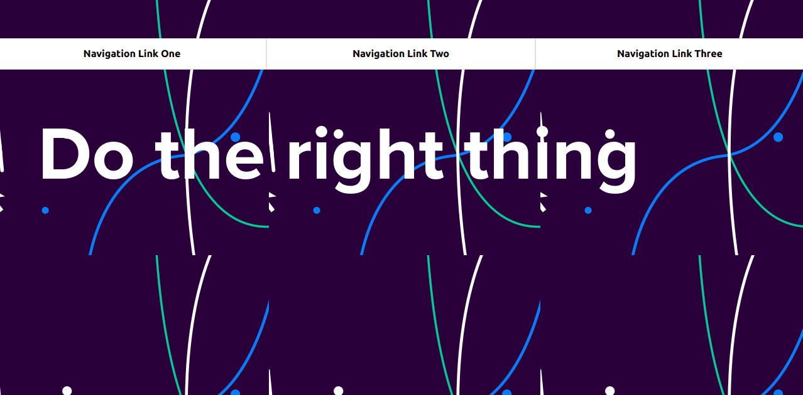
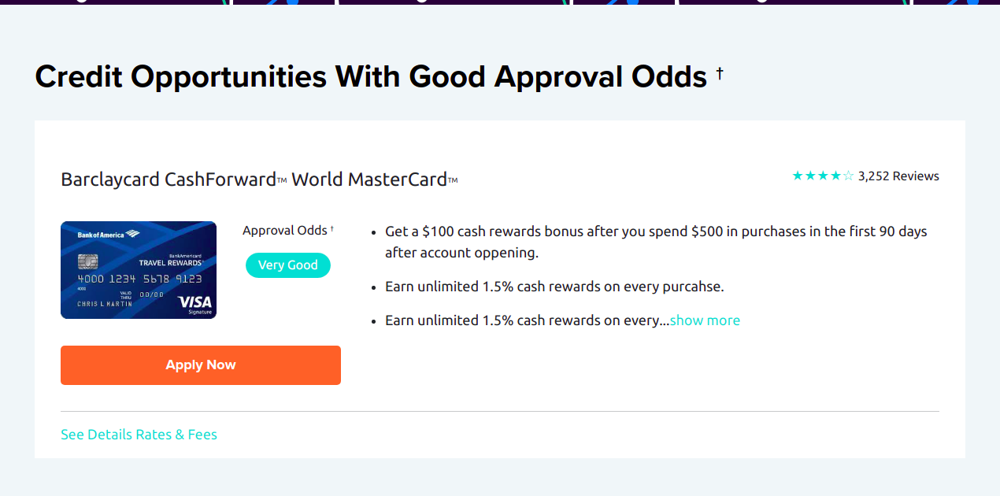

# slicing-test
This slicing test is based on designing the Ithaca page into the correct html and css format so that it will work well on both desktop and mobile.

## Screenshot

# Project Specification

1. Build the page to be responsive
2. Use the Fonts provided with the AI file.
3. Add styling according to the Ithaca page style.

## Built With

- HTML5
- CSS3
- Bootstrap5

## Getting Started

To get a local copy up and running follow these steps:

### Prerequisites

### Setup

- Clone the repository by running the code `git clone https://github.com/tGodson/slicing-test.git`.
- cd into slicing-test folder.
- Click on the index.html file so it opens on the browser.

👤 **Tendongze Godson**

- Github: [tGodson](https://github.com/tGodson)
- Twitter: [@tendongze95](https://twitter.com/tendongze95)
- Linkedin: [linkedin](https://www.linkedin.com/in/tendongzegodson)
- Email: [email](tendongzegodson@gmail.com)

## Show your support

Give a ⭐️ if you like this project!

## Acknowledgments

[Wallethub](https://wallethub.com/)
